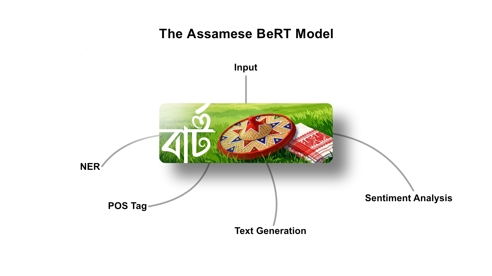

<div align="center">
  
</div>

---

# Assamese NLP with IndicBERTv2 — Fine-Tuning for NER, POS, Sentiment Analysis & MLM

> **Internship Project** · Information Technology Department · Gauhati University

This project was developed as part of an internship at the **Information Technology Department, Gauhati University**. It explores the application of the **IndicBERTv2** model — a state-of-the-art multilingual BERT model trained on Indic languages — to several core Natural Language Processing (NLP) tasks for the **Assamese language** (অসমীয়া).

The notebook fine-tunes `ai4bharat/IndicBERTv2-MLM-only` on custom Assamese datasets to perform:

| Task | Description |
|------|-------------|
| 🏷️ **Named Entity Recognition (NER)** | Identifies and classifies named entities (persons, locations, organizations, etc.) in Assamese text |
| 🔤 **Part-of-Speech Tagging (POS)** | Labels each token with its grammatical role (noun, verb, adjective, etc.) |
| 💬 **Sentiment Analysis** | Classifies Assamese sentences as **Positive**, **Neutral**, or **Negative** |
| 🎭 **Masked Language Modeling (MLM)** | Predicts masked tokens in Assamese sentences using the pre-trained model |

---

## 📋 Table of Contents

- [Prerequisites](#prerequisites)
- [Step 1 — Set Up Google Colab](#step-1--set-up-google-colab)
- [Step 2 — Configure Hugging Face Authentication](#step-2--configure-hugging-face-authentication)
- [Step 3 — Prepare Your Dataset Files](#step-3--prepare-your-dataset-files)
- [Step 4 — Run the Notebook](#step-4--run-the-notebook)
- [Step 5 — Interactive Inference](#step-5--interactive-inference)
- [Project Structure](#project-structure)
- [Dependencies](#dependencies)
- [⚠️ Performance Warning](#%EF%B8%8F-performance-warning--model-recommendations)

---

## Prerequisites

Before running this project, make sure you have:

- A **Google account** (required for Google Colab)
- A **Hugging Face account** — sign up free at [huggingface.co](https://huggingface.co/)
- Your custom Assamese dataset files in the following formats:
  - `sentences.txt` — one raw Assamese sentence per line
  - `NER.csv` — token-tag pairs separated by tabs (`\t`), with blank lines separating sentences
  - `POS.json` — JSON array of objects, each with a `"sentence"` key and a `"tags"` dictionary
  - An Assamese **Sentiment JSON** file with labeled sentences (Positive / Neutral / Negative)

---

## Step 1 — Set Up Google Colab

1. Go to [colab.research.google.com](https://colab.research.google.com/)
2. Click **File → Open notebook → GitHub / Upload** and open the `Project.ipynb` file from this repository
3. **Enable GPU** for faster training:
   - Go to **Runtime → Change runtime type**
   - Set **Hardware accelerator** to `GPU` (T4 is recommended and free)
   - Click **Save**

---

## Step 2 — Configure Hugging Face Authentication

The notebook uses `ai4bharat/IndicBERTv2-MLM-only` from Hugging Face Hub, which requires authentication.

**Steps to set up your token:**

1. Log in to [huggingface.co](https://huggingface.co/) → go to **Settings → Access Tokens**
2. Click **New token**, give it a name, select **Read** access, and copy the token
3. In Google Colab, click the **🔑 Key icon** in the left sidebar to open **Secrets**
4. Click **+ Add a new secret**:
   - **Name:** `HF_TOKEN`
   - **Value:** *(paste your Hugging Face token)*
5. Toggle **"Notebook access"** to ON
6. Run the authentication cell in the notebook (it loads `HF_TOKEN` automatically from Colab Secrets)

---

## Step 3 — Prepare Your Dataset Files

The notebook will prompt you to upload your dataset files interactively via Colab's file upload widget. Prepare the following files before running:

### `sentences.txt`
Plain text file with **one Assamese sentence per line**:
```
হোটেলটোৰ নাম হোষ্টেল টামলো ।
মই আজি গুৱাহাটীলৈ গৈছিলোঁ ।
```

### `NER.csv`
Tab-separated token-tag pairs; blank line separates sentences:
```
হোটেলটোৰ	O
নাম	O
হোষ্টেল	B-FAC
টামলো	I-FAC
।	O

মই	O
আজি	B-TIME
```

### `POS.json`
JSON array, each element with `"sentence"` (space-joined tokens) and `"tags"` (token → POS tag mapping):
```json
[
  {
    "sentence": "হোটেলটোৰ নাম হোষ্টেল টামলো ।",
    "tags": {
      "হোটেলটোৰ": "N_NN",
      "নাম": "N_NN",
      "হোষ্টেল": "N_NNP",
      "টামলো": "N_NNP",
      "।": "RD_PUNC"
    }
  }
]
```

### Sentiment JSON
A JSON file with Assamese sentences and sentiment labels (`0` = Negative, `1` = Neutral, `2` = Positive).

---

## Step 4 — Run the Notebook

Run the cells **in order from top to bottom**. Here is a summary of what each major section does:

| Section | What it does |
|---------|--------------|
| **Install Dependencies** | Installs `transformers`, `datasets`, `accelerate`, `seqeval`, `sentencepiece`, `evaluate`, `scikit-learn`, `matplotlib`, `seaborn` |
| **Load Tokenizer** | Downloads `IndicBERTv2` tokenizer with `keep_accents=True` to preserve Assamese vowel matras |
| **Upload & Parse Data** | Prompts for file uploads and parses/aligns NER, POS, and Sentiment data |
| **Tokenize & Align Labels** | Aligns word-level labels to subword tokens; uses `-100` for special tokens to exclude from loss |
| **Fine-tune NER Model** | Trains `AutoModelForTokenClassification` on NER data (80/20 train-test split) |
| **Fine-tune POS Model** | Trains `AutoModelForTokenClassification` on POS data |
| **Fine-tune Sentiment Model** | Trains `AutoModelForSequenceClassification` on 60/20/20 train-val-test split |
| **MLM Inference** | Uses the base `IndicBERTv2` model for masked token prediction without fine-tuning |
| **Evaluate** | Generates accuracy, precision, recall, F1-score, confusion matrix, and bar charts |

---

## Step 5 — Interactive Inference

After training, the notebook provides **interactive inference cells** for each task. Simply type an Assamese sentence when prompted:

### NER & POS Tagging
```python
# Input your sentence in the inference cell
sentence = "মহাত্মা গান্ধী ভাৰতৰ স্বাধীনতাৰ নেতা আছিল ।"
# Output: DataFrame with token | NER tag | POS tag columns
```

### Masked Language Modeling
```python
# Use [MASK] in the sentence
sentence = "গুৱাহাটী অসমৰ [MASK] চহৰ ।"
# Output: Top 5 predicted words for [MASK]
```

### Sentiment Analysis
```python
sentence = "এই চলচ্চিত্ৰখন অতি সুন্দৰ আছিল ।"
# Output: POSITIVE / NEUTRAL / NEGATIVE with confidence score
```

---

## Project Structure

```
📁 repo/
├── 📓 Project.ipynb      # Main Colab notebook with all code and outputs
├── 🖼️  image.jpg          # Project banner image
└── 📄 README.md          # This file
```

> **Note:** Dataset files (`sentences.txt`, `NER.csv`, `POS.json`, Sentiment JSON) are uploaded directly inside the Colab session and are **not committed** to the repository.

---

## Dependencies

All dependencies are installed automatically inside the notebook. For reference:

```
transformers
datasets
accelerate
seqeval
sentencepiece
evaluate
scikit-learn
matplotlib
seaborn
torch
```

---

## ⚠️ Performance Warning & Model Recommendations

> **⚠️ WARNING: The performance of this model is limited.**

This project was built as a learning exercise using a **small, custom dataset** for the Assamese language. As a result, the fine-tuned models may exhibit **low accuracy, poor generalization, and unreliable predictions**, especially on real-world Assamese text. The small dataset size significantly restricts what the model can learn.

### ✅ Recommended Alternatives

For production-level or research-grade Assamese NLP, consider using the following more capable models:

| Model | Hugging Face ID | Why it's better |
|-------|----------------|-----------------|
| **mBERT** | `bert-base-multilingual-cased` | Trained on 104 languages including Assamese; strong multilingual baseline |
| **XLM-RoBERTa** | `xlm-roberta-base` or `xlm-roberta-large` | Trained on 100 languages with significantly more data; outperforms mBERT on low-resource languages |
| **MuRIL** | `google/muril-base-cased` | Specifically designed for **Indian languages** by Google; trained on 17 Indian languages including Assamese — often the best choice for Indic NLP tasks |

**Recommendation:** For Assamese specifically, **MuRIL** and **XLM-RoBERTa** tend to perform best due to their broader multilingual training corpora and better handling of low-resource Indic languages. Always use a larger, well-curated Assamese dataset for fine-tuning to get meaningful results.

---

## Demo Data
Taken from: [GUIT-AsTourNE: A Dataset of Assamese Named Entities in the Tourism Domain](https://github.com/nlp30/GUIT-AsTourNE)
```
@inproceedings{choudhury2024guit,
  title={GUIT-AsTourNE: A Dataset of Assamese Named Entities in the Tourism Domain},
  author={Choudhury, Bhargab and Deka, Vaskar and Sarma, Shikhar Kumar},
  booktitle={Proceedings of the 38th Pacific Asia Conference on Language, Information and Computation},
  pages={928--939},
  year={2024}
}
```
---

<div align="center">

Made with ❤️ at **Gauhati University** — Information Technology Department

</div>
